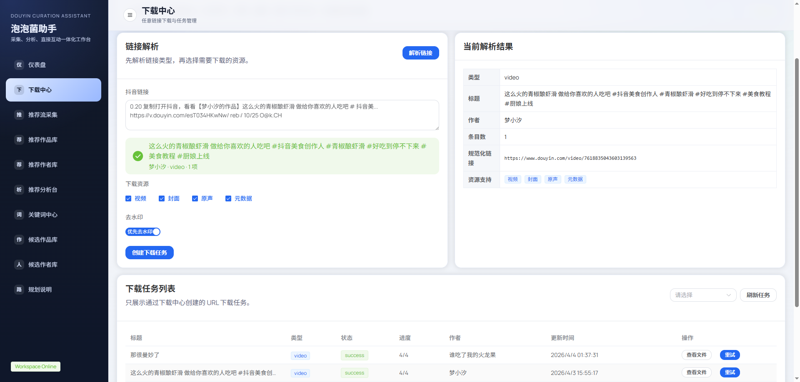
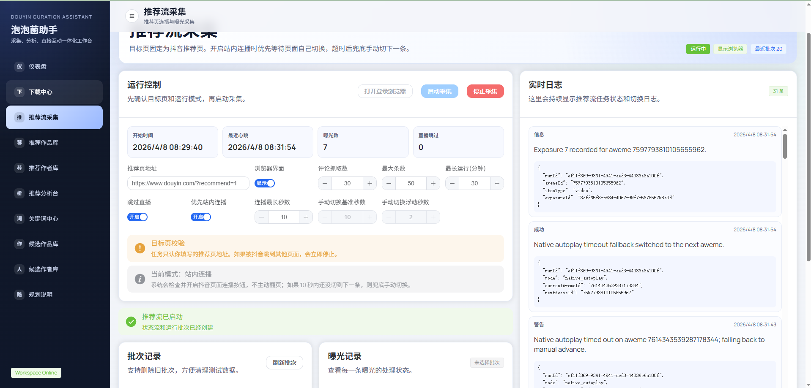
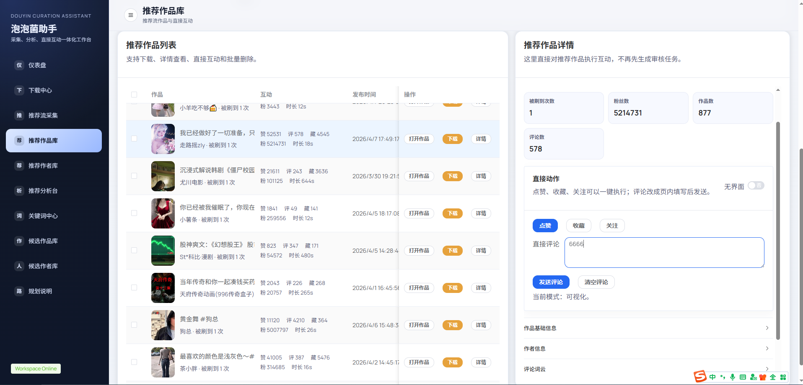
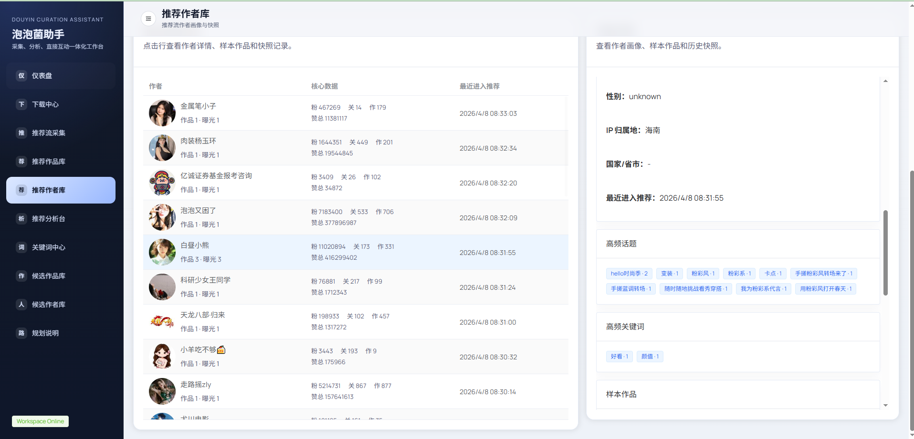
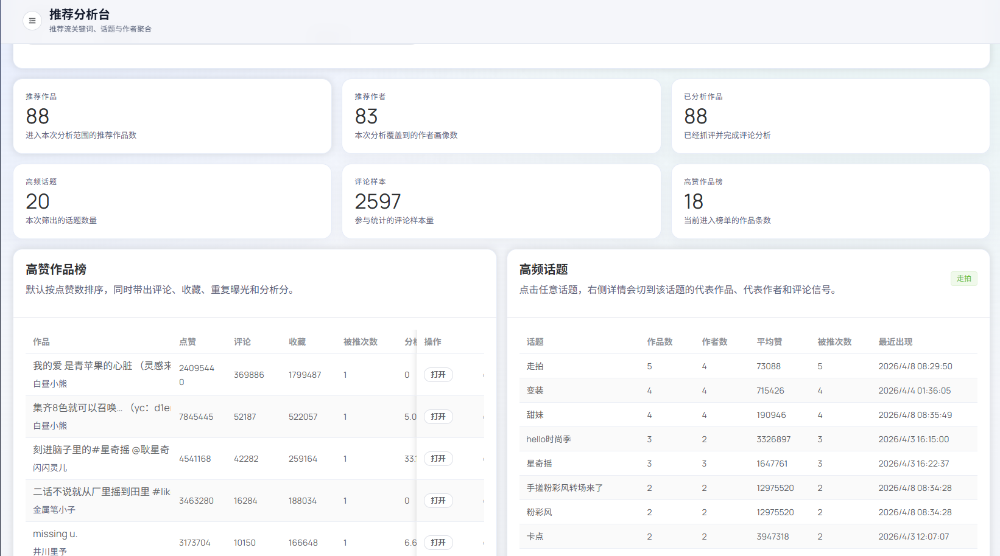
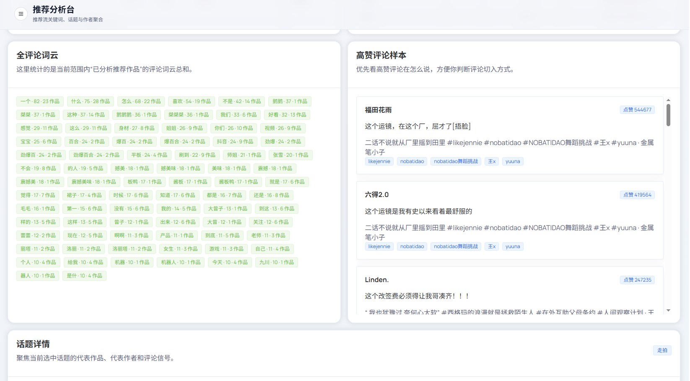
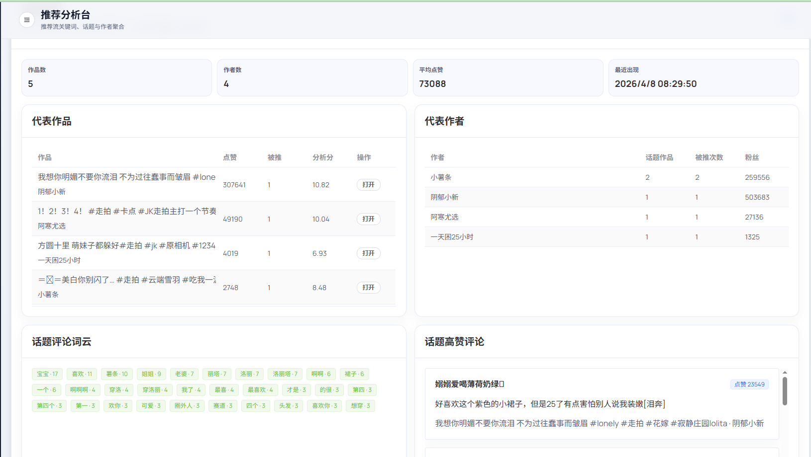
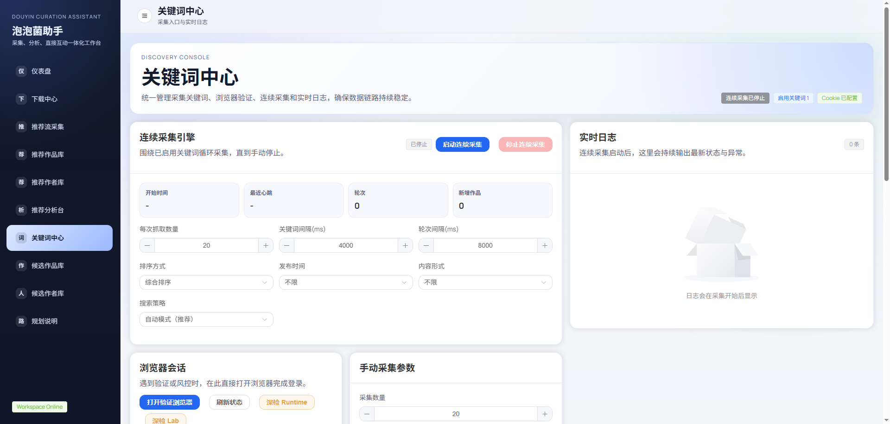

# Douyin Curation Assistant

本项目是一个面向本地工作站的抖音内容采集、筛选、分析与直达互动工作台，适合做本地化的数据采集、内容筛选、创作者画像和运营动作执行。

当前仓库的主链路已经覆盖：

- 关键词搜索采集作品
- 推荐流自动连播/刷视频与曝光采集
- 自动获取作品、作者、评论区信息
- 评论分析、词云、高赞评论提取
- 候选作者聚合与创作者画像沉淀
- 在作品详情里直接执行点赞、收藏、关注、评论
- 本地下载任务管理

项目整体定位不是云端群控，而是一个以本地 SQLite + 本地浏览器 + 本地数据目录为核心的受控工作流工具。

## 页面截图

<p align="center">
  
  
</p>
<p align="center">
  
  
</p>
<p align="center">
  
  
</p>
<p align="center">
  
  
</p>

## 当前实际能力

### 1. 关键词中心

- 维护采集关键词
- 手动按关键词发现作品
- 启动连续采集引擎，围绕已启用关键词循环抓取
- 配置排序方式、发布时间、内容形式、搜索策略
- 查看浏览器会话状态、Cookie 可用性和实时日志

### 2. 推荐流采集

- 打开抖音推荐页进行推荐流监听
- 支持自动/半自动刷推荐页
- 记录推荐流批次、曝光数据、跳过直播统计
- 将推荐作品、推荐作者、曝光历史沉淀到本地库

### 3. 候选作品库

- 汇总关键词采集或推荐链路沉淀下来的候选作品
- 按互动数据、状态、来源等条件筛选
- 抓取评论并执行评论分析
- 展示评论词云、高赞评论、作品详情
- 直接执行点赞、收藏、关注、评论
- 支持把当前作品加入下载任务

### 4. 推荐作品库

- 管理推荐流沉淀下来的作品
- 按作者、粉丝、点赞、评论、收藏、最近监听时间等条件筛选
- 查看作者信息、评论词云、高赞评论、曝光历史
- 直接执行点赞、收藏、关注、评论
- 支持下载推荐作品

### 5. 创作者画像

- 候选作者库：基于评论分析结果重建候选作者画像，并支持人工审核
- 推荐作者库：基于推荐流沉淀作者画像、作品样本和历史快照
- 推荐分析台：聚合高赞作品、高频话题、全评论词云、高赞评论样本、话题详情

### 6. 下载中心

- 解析抖音视频、图集、合集、音乐链接
- 创建下载任务并查看执行结果
- 支持视频、图集、封面、原声、元数据下载
- 主业务聚焦抖音，但下载模块还兼容部分第三方平台链接解析
  - 当前代码里已覆盖 `Bilibili / Xiaohongshu / Instagram / TikTok / X`

### 7. 浏览器实验室

- 提供独立的浏览器 Lab 目录与抓包/动作回放辅助脚本
- 用于分析点赞、收藏、关注、评论相关请求
- 适合调试抖音前端交互变化，不直接影响主流程

## 当前范围与边界

这是根据当前仓库代码写的“真实范围”，方便你开源时把预期说清楚。

### 当前重点

- 本地采集
- 本地评论分析
- 作者筛选与画像沉淀
- 作品级直接互动
- 下载任务管理

### 当前未作为主流程启用

- 动作规则管理页
- 评论模板管理页
- 审核队列工作流
- 分析词典页面

这几个接口在当前后端路由里仍保留占位，但已经被禁用，不是现在这版的主工作流。

### 旧项目关系

仓库仍保留了对旧 Python 项目的参考桥接，但当前 Node 后端已经把它视为“参考代码/稳定性兜底”，运行时主链路正在迁移到本仓库内部。

### 运行环境边界

- 当前更偏向 Windows 本地工作站使用场景
- 启动脚本、浏览器发现、端口清理等辅助能力优先按 PowerShell/Windows 写的
- 浏览器自动化依赖本机可用的 Edge 或 Chrome

## 技术栈

- 前端：`Vue 3` + `Vite` + `Element Plus`
- 后端：`Express`
- 数据存储：`better-sqlite3`
- 浏览器自动化：`playwright-core`
- 下载链路：`Python + yt-dlp + ffmpeg-static`

## 目录结构

```text
Douyin_Curation_Assistant/
├─ client/                     # Vue 前端
├─ server/                     # Express 后端与采集/分析/自动化服务
├─ scripts/                    # 开发辅助脚本
├─ .runtime/                   # 浏览器 profile、lab 数据、运行时缓存
├─ jsonData/                   # SQLite、下载文件、本地业务数据
├─ .env.example
├─ start_dev.ps1
└─ stop_dev.ps1
```

## 开发环境

当前仓库在本地实际开发环境中使用的是：

- Windows + PowerShell
- Node.js `v22.10.0`
- npm `10.9.0`
- Python `3.12.4`

如果你打算开源给别人使用，建议在 README 中保持“推荐环境”而不是“唯一环境”：

- Node.js `20+`
- npm `10+`
- Python `3.10+`
- 本机已安装 Edge 或 Chrome

## 快速开始

### 1. 安装依赖

```powershell
npm install
```

下载中心依赖 `yt-dlp`，需要额外准备 Python 包：

```powershell
python -m pip install -U yt-dlp
```

### 2. 初始化环境变量

```powershell
Copy-Item .env.example .env
```

如果你使用的是：

```powershell
.\start_dev.ps1
```

那么当 `.env` 不存在时，脚本会自动从 `.env.example` 复制一份。

至少建议先确认下面这些配置：

- `PORT`
- `DATA_ROOT`
- `SQLITE_PATH`
- `CLIENT_ORIGIN` / `CLIENT_ORIGINS`
- `VITE_DEV_PROXY_TARGET`
- `DY_COOKIES`
- `ACTION_BROWSER_HEADLESS`
- `ACTION_BROWSER_TIMEOUT_MS`

如果你的浏览器没有被自动识别，也可以额外设置：

- `ACTION_BROWSER_EXECUTABLE`
- 或 `BROWSER_EXECUTABLE_PATH`

### 3. 准备浏览器登录态

首次使用推荐流采集、关键词搜索兜底、直接互动前，建议先执行：

```powershell
npm run prepare:browser
```

这个命令会：

- 打开一个本地浏览器 Profile
- 尝试注入 `.env` 中的 `DY_COOKIES`
- 让你在可视化浏览器里完成登录/验证码
- 把运行时 Cookie 和存储状态写入 `.runtime`

### 4. 启动开发环境

推荐直接用 PowerShell 脚本：

```powershell
.\start_dev.ps1
```

或直接运行：

```powershell
npm run dev
```

默认地址：

- 前端：`http://localhost:5173`
- 后端：`http://localhost:3001`
- API 前缀：`/api/v1`

后端首次启动时会自动创建本地 SQLite 文件和对应数据目录。

如果端口被占用，可以执行：

```powershell
.\stop_dev.ps1
```

## 环境变量说明

| 变量名 | 说明 |
| --- | --- |
| `PORT` | 后端端口，默认 `3001` |
| `DATA_ROOT` | 本地数据根目录，默认 `./jsonData` |
| `SQLITE_PATH` | SQLite 文件路径，默认 `./jsonData/douyin_curation_assistant.db` |
| `CLIENT_ORIGIN` / `CLIENT_ORIGINS` | 允许访问后端的前端来源 |
| `VITE_DEV_PROXY_TARGET` | Vite 开发代理目标，默认 `http://localhost:3001` |
| `LEGACY_PROJECT_PATH` | 旧 Python 项目路径，可选 |
| `DY_COOKIES` | 从已登录抖音浏览器复制出来的 Cookie 字符串 |
| `ACTION_BROWSER_HEADLESS` | 互动执行是否无头运行 |
| `ACTION_BROWSER_KEEP_OPEN_ON_FAILURE` | 失败时是否保留浏览器窗口用于排查 |
| `ACTION_BROWSER_FAILURE_HOLD_MS` | 失败页面保留时长 |
| `ACTION_BROWSER_TIMEOUT_MS` | 浏览器动作超时时间 |
| `ACTION_CAPTURE_TARGET_URL` | 动作抓包默认目标作品页 |

## 常用命令

### 根目录

```powershell
npm run dev
npm run dev:client
npm run dev:server
npm run build
npm run start:server
npm run prepare:browser
npm run capture:actions
npm run lab:watch-browser
npm run lab:watch-browser:all
npm run lab:extract-actions
npm run lab:run-action
```

### 命令说明

- `npm run dev`：同时启动前后端
- `npm run build`：构建前端
- `npm run prepare:browser`：打开可视浏览器准备运行时登录态
- `npm run capture:actions`：打开浏览器并记录手动动作请求
- `npm run lab:watch-browser`：启动独立浏览器实验室监听器
- `npm run lab:extract-actions`：提取最近一次实验室动作摘要
- `npm run lab:run-action`：在实验室里执行单个动作回放

## 建议使用顺序

```text
准备 Cookie / 浏览器登录态
-> 关键词中心配置关键词并启动采集
-> 候选作品库补齐评论分析
-> 候选作者库重建作者画像并人工筛选
-> 推荐流采集补充推荐作品与作者信号
-> 在候选作品库 / 推荐作品库中直接执行互动
-> 需要时创建下载任务做素材沉淀
```

## 本地数据落地位置

默认情况下，项目运行时数据会写到这些位置：

- SQLite：`jsonData/douyin_curation_assistant.db`
- 下载文件：`jsonData/downloads/`
- 运行时浏览器目录：`.runtime/browser-profile/`
- 推荐流浏览器目录：`.runtime/recommend-browser-profile/`
- 实验室浏览器目录：`.runtime/lab-browser-profile/`

仓库里的 `.gitignore` 已经忽略了这些本地运行数据，以及 `.env`、`.runtime`、`jsonData` 等内容。

## 开源说明建议

如果你准备发布到 GitHub，建议把项目介绍保持在下面这个语义上：

> 一个面向本地工作站的抖音内容采集、评论分析、创作者画像与直达互动工作台，适合做本地化数据采集、内容筛选和运营动作工作流。

比起强调“全自动”，这版项目更适合强调：

- 本地部署
- 数据沉淀
- 可见工作流
- 人工可介入
- 采集、分析、执行一体化

## 合规与风险提示

- 请遵守抖音及相关平台的服务条款、接口规则和当地法律法规
- 请勿将本项目用于垃圾评论、批量骚扰、绕过风控或其他滥用场景
- 涉及 Cookie、账号登录态、下载内容和作者数据时，请自行做好本地安全与权限隔离
- 平台前端结构或接口变化后，浏览器动作和采集逻辑可能需要维护

## 后续可继续完善的方向

- 增加开源首页截图/GIF
- 增加 Docker 或生产部署说明
- 补充 API 文档
- 补充数据库表结构说明
- 补充更细的“从 0 到 1 使用流程”
- 拆分 `README` 与 `docs/` 文档
